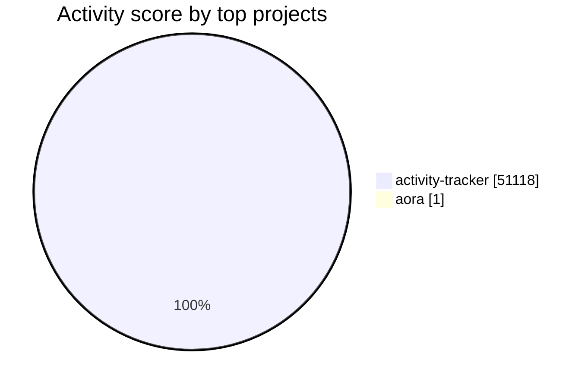

# Activity Visualizations

PNG assets are generated for profile display. SVG versions remain here for debugging and iteration.

## Quick Stats

| Metric | Value |
| --- | ---: |
| Tracked saves | 85 |
| Active days | 3 |
| Lines changed | 49K |
| Current streak | 2 |

## Top Projects

| Project | Saves | Lines changed | Score |
| --- | ---: | ---: | ---: |
| activity-tracker | 84 | 49K | 51K |
| aora | 1 | 0 | 1 |

## Top Files

| File | Saves | Lines changed | Score |
| --- | ---: | ---: | ---: |
| styles.css | 20 | 22K | 22K |
| app.js | 42 | 18K | 20K |
| index.html | 14 | 8.3K | 8.3K |
| test.js | 7 | 0 | 7 |
| test.js | 1 | 5 | 5 |

## Mermaid Snapshot

## Rendered Assets

### Summary

### Heatmap

### Project Progress
